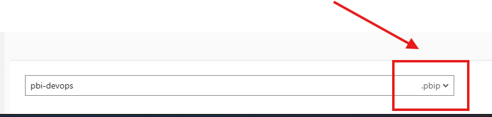
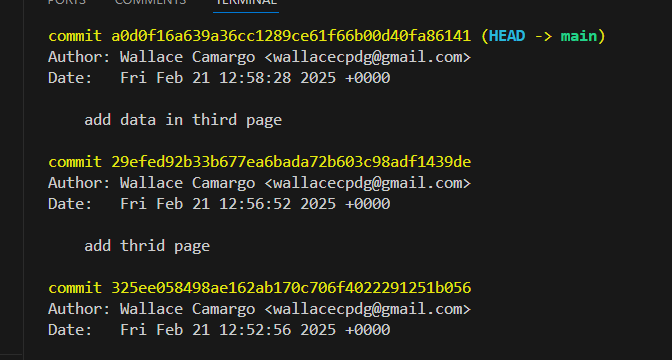
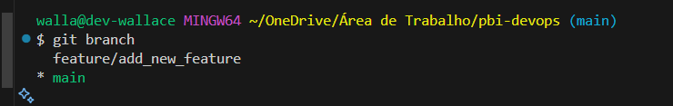
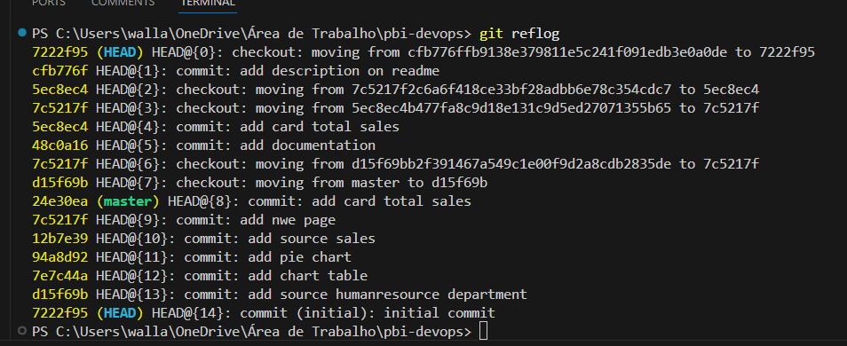

# Versionamento do Power BI com Git
O objetivo deste repositório é exemplificar o versionamento do Power BI com o git.


## Pré-requisitos
* Git instalado

* Configurar o git com o seu user e email

* Power BI Desktop instalado

* Salvar o arquivo Power BI com a extensão ```.pbip```

Exemplo do arquivo:




## Comandos git
Inicializar o git
```
git init
```

Verificar o status do projeto
```
git status
```

Adicionar alterações a ser versionada no track
```
git add <file>
```

Remover arquivo do track
```
git rm --cached <file>
```

Desfazer alterações
```
git restore <file>
```

Faça um commit inicial
```
git commit -m "Initial commit"
```

Verificar todos os commits (esse comando é útil para verificar todas as versões do teu projeto)
```
git log
```

Resultado esperado:



## Como voltar para um commit específico?
```
git checkout <hash do commit>
```

⚠️ Esse comando vai te levar o momento que a commit escolhido foi feito. Cabe ressaltar que ele apenas te direciona para essa branch, mas não apaga tudo que foi feito depois. Esse comando serve apenas para você avaliar como era o projeto naquele momento. 

## O que são branches?
São separações do seu projeto em ramificações.

## Criar uma branch nova
```
git branch feature/add_new_feature
```

## Como ver todas as branches?
```
git branch
```

Resultado esperado:



## Como ver todas as versões novamente?
```
git reflog
```

Resultado esperado:




⚠️ Veja o id do commit que deseja voltar e volte com o comando:
 
```
git checkout <id_da_hash>
```

## Como enviar o projeto para o Github (ou o seu hub de códigos)
```
git push
```

## 📚 Referências
https://learn.microsoft.com/pt-pt/power-bi/developer/projects/projects-git

## 🧑🏼‍🚀 Developer
| Desenvolvedor      | LinkedIn                                   | Email                        | Portfólio                              |
|--------------------|--------------------------------------------|------------------------------|----------------------------------------|
| Wallace Camargo    | [LinkedIn](https://www.linkedin.com/in/wallace-camargo-35b615171/) | wallacecpdg@gmail.com        | [Portfólio](https://wlcamargo.github.io/)   |
